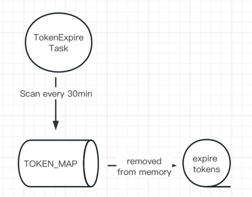

# A simple authentication and authorization service
## 主要实现的功能
项目实现了对用户、角色、用户角色绑定、token生成以及验证功能，细分功能点如下：
- 用户创建、删除
- 角色创建、删除
- 给用户赋予角色
- 加密token生成
- 根据token验证角色
- 根据token查询用户所有角色
- token定期失效管理功能

## 用到的技术栈
- springcloud 2021.0.1 version + springboot 2.7.5 version
- maven
- java8
- 数据均存在内存

## 用到的jdk之外的依赖
可以在pom文件中找到对应依赖，分别是：
- hutool-all hutool工具，本项目用作处理token的json格式化
- spring-security-crypto 用作处理密码的hash加密与验证
- 其他springboot框架自带依赖

## token过期策略
- 通过接口触发验证失效token
- 手动Invalidate
- 定时任务定期扫描过期token并删除

## 单元测试
覆盖率已达100%，用例请参照：
- UserRoleServiceTest：负责用户角色权限service的方法测试
- TokenExpireTaskTest：负责token定时过期删除的方法测试

## 加分功能点
然而，作者认为除实现基本功能之外，还有加分功能点：
- api版本号管理
- spring-logback日志管理